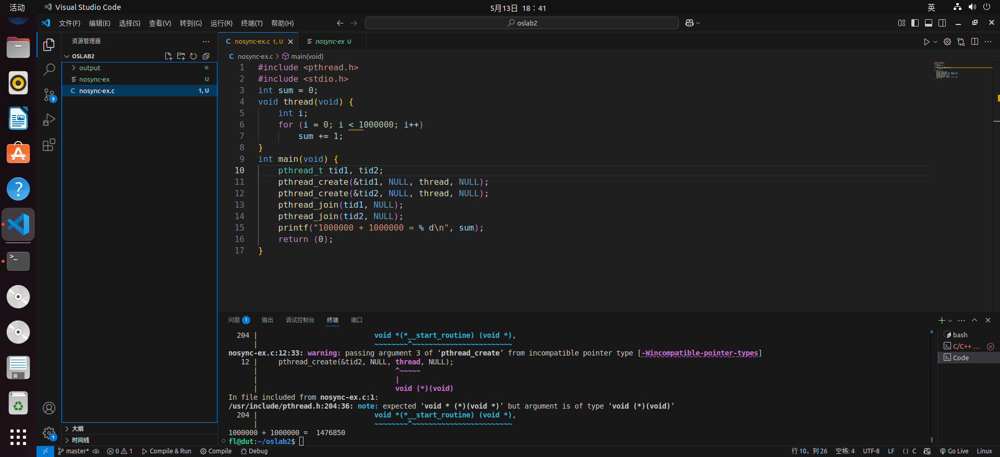
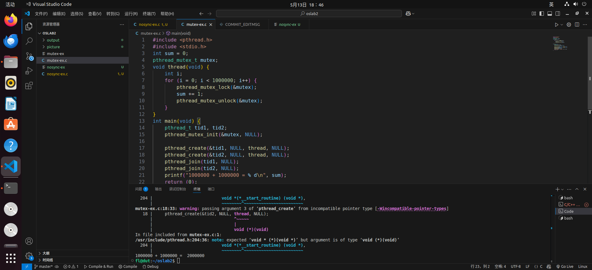
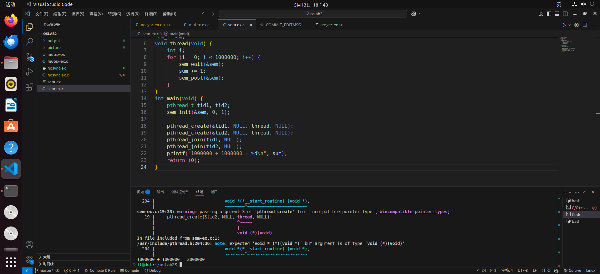
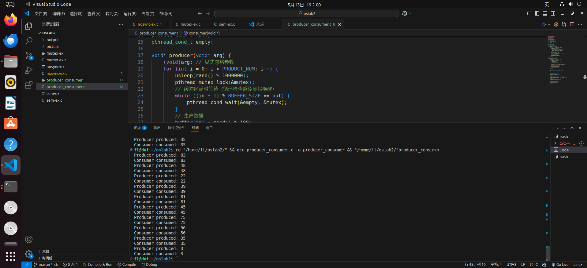
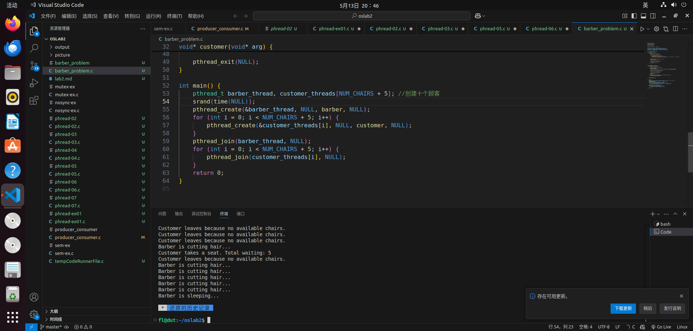

# 操作系统 实验二 Linux下多线程编程实践
### 本次上机要求完成三个示例代码的运行，并自己使用 Linux 的线程 API 实现一个生产者消费者问题

这是 `nosync-ex.c` 的实现：
```c
#include <pthread.h>
#include <stdio.h>
int sum = 0;
void thread(void) {
    int i;
    for (i = 0; i < 1000000; i++)
        sum += 1;
}
int main(void) {
    pthread_t tid1, tid2;
    pthread_create(&tid1, NULL, thread, NULL);
    pthread_create(&tid2, NULL, thread, NULL);
    pthread_join(tid1, NULL);
    pthread_join(tid2, NULL);
    printf("1000000 + 1000000 = % d\n", sum);
    return (0);
}
```
运行结果如下：


这是 `mutex-ex.c` 的实现：
```c
#include <pthread.h>
#include <stdio.h>
int sum = 0;
pthread_mutex_t mutex;
void thread(void) {
    int i;
    for (i = 0; i < 1000000; i++) {
        pthread_mutex_lock(&mutex);
        sum += 1;
        pthread_mutex_unlock(&mutex);
    }
}
int main(void) {
    pthread_t tid1, tid2;
    pthread_mutex_init(&mutex, NULL);

    pthread_create(&tid1, NULL, thread, NULL);
    pthread_create(&tid2, NULL, thread, NULL);
    pthread_join(tid1, NULL);
    pthread_join(tid2, NULL);
    printf("1000000 + 1000000 = % d\n", sum);
    return (0);
}
```
运行结果如下：



这是 `sem-ex.c` 的实现：
```c
#include <pthread.h>
#include <semaphore.h>
#include <stdio.h>
int sum = 0;
sem_t sem;
void thread(void) {
    int i;
    for (i = 0; i < 1000000; i++) {
        sem_wait(&sem);
        sum += 1;
        sem_post(&sem);
    }
}
int main(void) {
    pthread_t tid1, tid2;
    sem_init(&sem, 0, 1);

    pthread_create(&tid1, NULL, thread, NULL);
    pthread_create(&tid2, NULL, thread, NULL);
    pthread_join(tid1, NULL);
    pthread_join(tid2, NULL);
    printf("1000000 + 1000000 = %d\n", sum);
    return (0);
}
```

运行结果如下：


生产者消费者问题：

```c
#include <pthread.h>
#include <stdio.h>
#include <stdlib.h>
#include <unistd.h>

#define BUFFER_SIZE 5
#define PRODUCT_NUM 10

int buffer[BUFFER_SIZE];
int in = 0;
int out = 0;

pthread_mutex_t mutex;
pthread_cond_t full;
pthread_cond_t empty;

void* producer(void* arg) {
    (void)arg; // 显式忽略参数
    for (int i = 0; i < PRODUCT_NUM; i++) {
        usleep(rand() % 1000000);
        pthread_mutex_lock(&mutex);
        // 缓冲区满时等待（循环检查避免虚假唤醒）
        while ((in + 1) % BUFFER_SIZE == out) {
            pthread_cond_wait(&empty, &mutex);
        }
        // 生产数据
        buffer[in] = rand() % 100;
        printf("Producer produced: %d\n", buffer[in]);
        in = (in + 1) % BUFFER_SIZE;
        // 通知消费者缓冲区非空
        pthread_cond_signal(&full);
        pthread_mutex_unlock(&mutex);
    }
    return NULL;
}

void* consumer(void* arg) {
    (void)arg; // 显式忽略参数
    for (int i = 0; i < PRODUCT_NUM; i++) {
        usleep(rand() % 1000000);
        pthread_mutex_lock(&mutex);
        // 缓冲区空时等待
        while (in == out) {
            pthread_cond_wait(&full, &mutex);
        }
        // 消费数据
        printf("Consumer consumed: %d\n", buffer[out]);
        out = (out + 1) % BUFFER_SIZE;
        // 通知生产者缓冲区非满
        pthread_cond_signal(&empty);
        pthread_mutex_unlock(&mutex);
    }
    return NULL;
}

int main() {
    pthread_t producer_thread, consumer_thread;

    srand(time(NULL));

    // 初始化同步资源
    pthread_mutex_init(&mutex, NULL);
    pthread_cond_init(&full, NULL);
    pthread_cond_init(&empty, NULL);

    // 创建线程
    pthread_create(&producer_thread, NULL, producer, NULL);
    pthread_create(&consumer_thread, NULL, consumer, NULL);

    // 等待线程结束
    pthread_join(producer_thread, NULL);
    pthread_join(consumer_thread, NULL);

    // 销毁同步资源
    pthread_mutex_destroy(&mutex);
    pthread_cond_destroy(&full);
    pthread_cond_destroy(&empty);

    return 0;
}
```

这是运行结果：



理发师问题：
```c
#include <pthread.h>
#include <stdio.h>
#include <stdlib.h>
#include <unistd.h>

#define NUM_CHAIRS 5  //五把椅子

pthread_mutex_t mutex = PTHREAD_MUTEX_INITIALIZER;
pthread_cond_t barber_sleep = PTHREAD_COND_INITIALIZER;
pthread_cond_t customer_wait = PTHREAD_COND_INITIALIZER;

int waiting_customers = 0;

void* barber(void* arg) {
    while (1) {
        pthread_mutex_lock(&mutex);

        while (waiting_customers == 0) {
            printf("Barber is sleeping...\n");
            pthread_cond_wait(&barber_sleep, &mutex); //​释放锁​：允许顾客线程进入临界区
        }

        printf("Barber is cutting hair...\n");
        waiting_customers--;

        pthread_mutex_unlock(&mutex);

        sleep(rand() % 3 + 1);
    }
}

void* customer(void* arg) {
    pthread_mutex_lock(&mutex);

    if (waiting_customers < NUM_CHAIRS) {
        waiting_customers++;
        printf("Customer takes a seat. Total waiting: %d\n", waiting_customers);

        pthread_cond_signal(&barber_sleep);

        pthread_mutex_unlock(&mutex);

        sleep(rand() % 5 + 1);
    } else {
        printf("Customer leaves because no available chairs.\n");
        pthread_mutex_unlock(&mutex);
    }

    pthread_exit(NULL);
}

int main() {
    pthread_t barber_thread, customer_threads[NUM_CHAIRS + 5]; //创建十个顾客
    srand(time(NULL));
    pthread_create(&barber_thread, NULL, barber, NULL);
    for (int i = 0; i < NUM_CHAIRS + 5; i++) {
        pthread_create(&customer_threads[i], NULL, customer, NULL);
    }
    pthread_join(barber_thread, NULL);
    for (int i = 0; i < NUM_CHAIRS + 5; i++) {
        pthread_join(customer_threads[i], NULL);
    }
    return 0;
}
```
运行结果如图：
