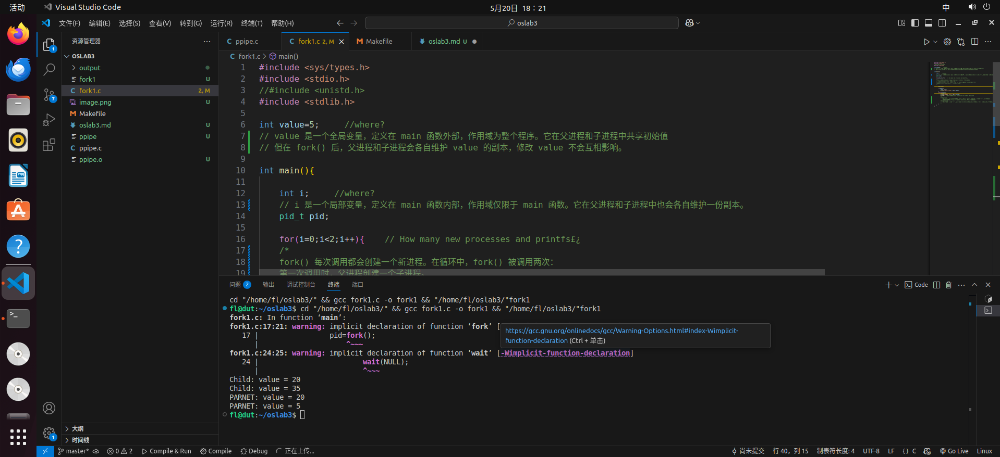

# 管道
### 使用Makefile编译并运行
 


# fork1.c
输入代码并观察结果

### 结果为：
``` c
Child: value = 20
Child: value = 35
PARNET: value = 20
PARNET: value = 5
```
### 问题思考：
1.value 的位置（where?）：

value 是一个全局变量，定义在 main 函数外部，作用域为整个程序。它在父进程和子进程中共享初始值，但在 fork() 后，父进程和子进程会各自维护 value 的副本，修改 value 不会互相影响。

2.i 的位置（where?）：

i是一个局部变量，定义在 main 函数内部，作用域仅限于 main 函数。它在父进程和子进程中也会各自维护一份副本。

3.fork() 循环中会创建多少个新进程？

fork() 每次调用都会创建一个新进程。在循环中，fork() 被调用两次：
第一次调用时，父进程创建一个子进程。
第二次调用时，父进程和第一个子进程都会执行 fork()，因此会再创建两个新进程。
总共会有 4 个进程（1 个父进程 + 3 个子进程）。

4.exit(0) 的作用

有 exit(0)：
父进程在执行完 printf("PARNET: value = %d\n", value); 后会立即退出，不会继续执行后续代码。
这样可以避免父进程在循环中再次调用 fork()，从而限制进程的数量。
没有 exit(0)：
父进程不会退出，会继续执行循环中的下一次 fork()，这会导致进程数量进一步增加，可能导致进程爆炸（进程数呈指数增长）。

# 独立实验
``` c
#include <stdio.h>
#include <stdlib.h>
#include <sys/types.h>
#include <unistd.h>

int fx(int x) {
    if (x == 1)
        return 1;
    return x * fx(x - 1);
}

int fy(int y) {
    if (y == 1 || y == 2)
        return 1;
    return fy(y - 1) + fy(y - 2);
}

int main() {
    pid_t pid_fx, pid_fy;
    int x, y;
    int pipe_fx[2], pipe_fy[2]; // 管道用于父子进程通信
    int result_fx, result_fy;

    printf("Input x and y:\n");
    scanf("%d %d", &x, &y);

    // 创建管道
    if (pipe(pipe_fx) == -1 || pipe(pipe_fy) == -1) {
        perror("Pipe creation failed");
        exit(EXIT_FAILURE);
    }

    // 创建第一个子进程计算 f(x)
    pid_fx = fork();
    if (pid_fx == 0) {
        close(pipe_fx[0]); // 关闭读端
        result_fx = fx(x);
        write(pipe_fx[1], &result_fx, sizeof(result_fx)); // 将结果写入管道
        close(pipe_fx[1]); // 关闭写端
        exit(0);
    }

    // 创建第二个子进程计算 f(y)
    pid_fy = fork();
    if (pid_fy == 0) {
        close(pipe_fy[0]); // 关闭读端
        result_fy = fy(y);
        write(pipe_fy[1], &result_fy, sizeof(result_fy)); // 将结果写入管道
        close(pipe_fy[1]); // 关闭写端
        exit(0);
    }

    // 父进程等待子进程完成并读取结果
    close(pipe_fx[1]); // 关闭写端
    close(pipe_fy[1]); // 关闭写端
    read(pipe_fx[0], &result_fx, sizeof(result_fx)); // 从管道读取 f(x) 的结果
    read(pipe_fy[0], &result_fy, sizeof(result_fy)); // 从管道读取 f(y) 的结果
    close(pipe_fx[0]); // 关闭读端
    close(pipe_fy[0]); // 关闭读端

    wait(NULL);
    wait(NULL);

    printf("f(x) = %d\n", result_fx);
    printf("f(y) = %d\n", result_fy);
    printf("f(x, y) = %d\n", result_fx + result_fy);

    return 0;
}

```
### 运行结果

